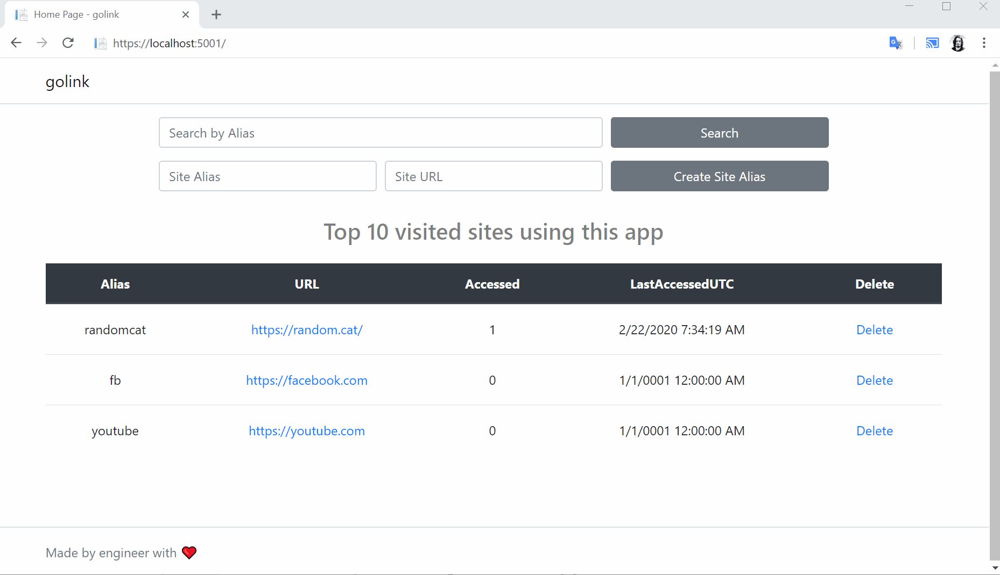

# GoLinks WebApp

## Content:

* [Overview](#Overview)

* [Feautures](#App-features)
* [Demo](#Small-demo)
* [Installation on Linux](#Linux-x64)
* [Installation on Windows](#windows)
* [Installation Demo](#Installation-Demo)
* [Known issues](#Known-issues)
* [ToDo](#ToDo)

### Overview

Using this site you can simplify mapping of compllex URLs to the meaningful alias.
Let's say that your user need to access mail and the URL is  https://office.outlook365.com/owa in this case you can register an alias like go/mail or https://go.domain.com/mail.

This project is built using asp.net core and can be packaged to run both on win32 or linux OS.

I have added an API controller [SiteController] in order to work in programatically way just in case you want to integrate something to it.

### App features:

* Creatining mapping
* Removing Mapping
* Search for aliases
* Logging how many times site was accessed
* Board on the home page with most visited sites
* API to work with site programmatically
  
Small demo:
---



# Installation

## Linux x64 
### (Tested on Centos and RHEL 7,8)

`NOTE: SELinux must be configured in order to run this app`

If you want to do a POC for this product you can temporary disable SELinux by running
```
setenforce 0
```
Then you can run these commands:

`[CENTOS7|RHEL7]`

```
wget https://github.com/MTokarev/golinks/blob/master/bin/Debug/netcoreapp2.2/linux-x64/linux-x64.tar.gz?raw=true -O /tmp/linux-x64.tar.gz
mkdir -p /var/www/golink
tar -xvf /tmp/linux-x64.tar.gz -C /var/www/golink
```
`[CENTOS8|RHEL8]`

```
wget https://github.com/MTokarev/golinks/blob/master/bin/Debug/netcoreapp2.2/linux-x64-rhel8/linux-x64-rhel8.tar.gz?raw=true -O /tmp/linux-x64-rhel8.tar.gz
mkdir -p /var/www/golink
tar -xvf /tmp/linux-x64-rhel8.tar.gz -C /var/www/golink
```

`For both 7 and 8`

```
mv /var/www/golink/golink.service /etc/systemd/system
chmod +x /var/www/golink/golink
systemctl enable golink
systemctl start golink
firewall-cmd --permanent --zone=public --add-service=http
firewall-cmd --reload
```


`NOW you can try to access your site by navigating http://yourhostname`

By default the app will bind to the 0.0.0.0:80 which can be ovverided by setting --urls in `/etc/systemd/system/golink.service`

From:

`ExecStart=/var/www/golink/golink --urls "http://0.0.0.0:80"`

To:

`ExecStart=/var/www/golink/golink --urls "http://0.0.0.0:8080"`

If you need to bind to the 8080 port.
This can be also helpful if you want to install your service to alternate port and put this app behind Apache or NGINX.

### Installation Demo

`Installing golink on CentOS7`


## Windows
### Tested on Windows 2012 R2 and Windows 2016

Open Powershell as an administrator and copy-paste followinf code:

```
$tmpFile="C:\Windows\Temp\win-x64.zip";$tmpHostingEnv="C:\Windows\Temp\ihe.exe";$webAppLocation="C:\inetpub\golink";Write-Host -ForegroundColor Green "[+]Spelling magic, it wouldn't take more than ages...";Write-Host -ForegroundColor Green "`t-Downloading binaries from github";[Net.ServicePointManager]::SecurityProtocol = [Net.SecurityProtocolType]::Tls12;Invoke-WebRequest https://github.com/MTokarev/golinks/blob/master/bin/Debug/netcoreapp2.2/win-x64/win-x64.zip?raw=true -OutFile $tmpFile;New-Item -Path $webAppLocation -Type Directory | Out-Null;Write-Host -ForegroundColor Green "`t-Expanding archive $tmpFile to $webAppLocation";[System.Reflection.Assembly]::LoadWithPartialName("System.IO.Compression.FileSystem") | Out-Null;[System.IO.Compression.ZipFile]::ExtractToDirectory($tmpFile, $webAppLocation);Write-Host -ForegroundColor Green "`t-Installing IIS";Install-WindowsFeature Web-Server -IncludeManagementTools | Out-Null;Write-Host -ForegroundColor Green "`t-Downloading Hosting Bundle from MSFT to support ASP.NET Core behind IIS";Invoke-WebRequest https://download.visualstudio.microsoft.com/download/pr/dd119832-dc46-4ccf-bc12-69e7bfa61b18/990843c6e0cbd97f9df68c94f6de6bb6/dotnet-hosting-3.1.2-win.exe -OutFile $tmpHostingEnv;
Write-Host -ForegroundColor Green "`t-Installing Hosting Bundle in zero touch mode";
Start-Process -FilePath $tmpHostingEnv -Wait -ArgumentList /passive;iisreset | Out-Null;New-WebAppPool -name "GoLinkAppPool" -Force | Out-Null;$appPool = Get-Item "IIS:\AppPools\GoLinkAppPool";$appPool.processModel.identityType = "NetworkService";$appPool | Set-Item;Write-Host -ForegroundColor Green "`t-Registring Site in IIS";new-WebSite -name "GoLink" -PhysicalPath "$webAppLocation\publish" -ApplicationPool "GoLinkAppPool" -force | Out-Null;Write-Host -ForegroundColor Green "`t-Allowing HTTP port passing Windows Firewall";New-NetFirewallRule -DisplayName "HTTP-TCP-80" -Direction Inbound -LocalPort 80 -Protocol TCP -Action Allow | Out-Null;Write-Host -ForegroundColor Green "`t***Execution has been completed***"
```

What Script will do:

1. Download Binaries from github
2. Install IIS
3. Download [Hosting Bundle](https://dotnet.microsoft.com/download/dotnet-core/thank-you/runtime-aspnetcore-2.2.8-windows-hosting-bundle-installer) to support .NET Core integration with IIS
4. Silently install Hosting Bundle
5. Create an IIS WebSite
6. Add HTTP exception to Firewall 

Thats it, you can try access your site.


### Logging
#### Linux
You can check logs by running:

`journalctl -fu golink.service`

### Known issues

Everything perfect, the only butterflies and rainbow in the project. Awaiting users feedback.

Please don't blame me to much, since it is my first project using .net

### ToDo

1. Move Logic to the service
2. Add AzureAD auth